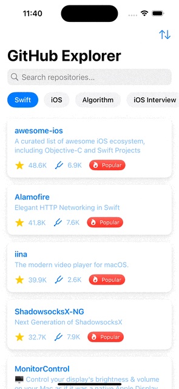
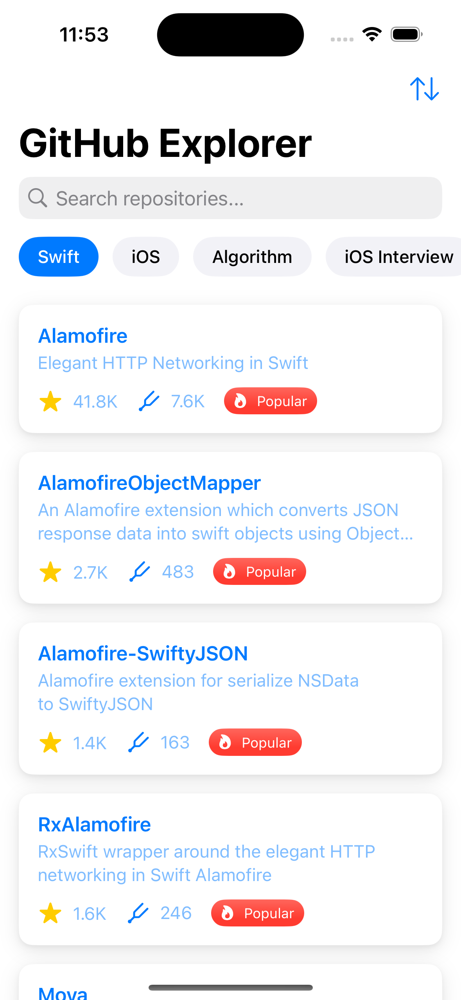
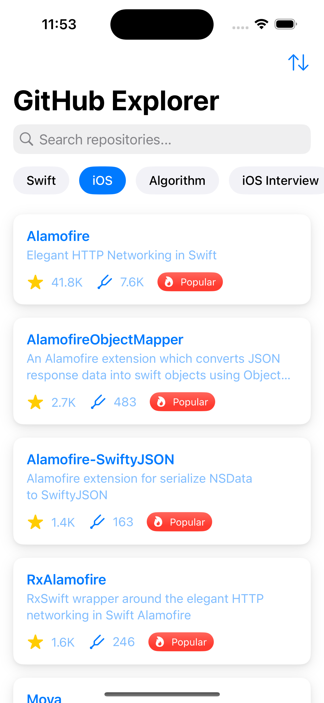
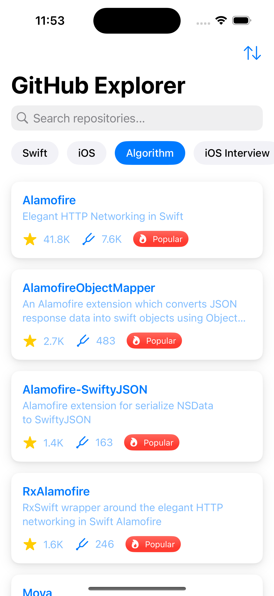
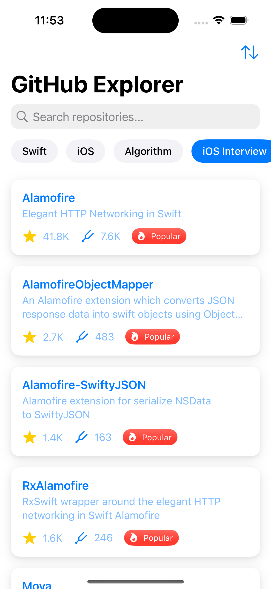
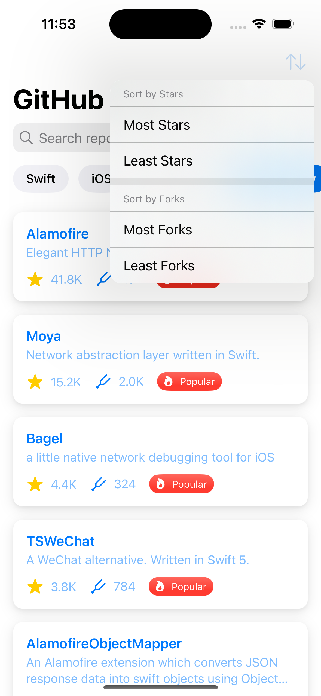
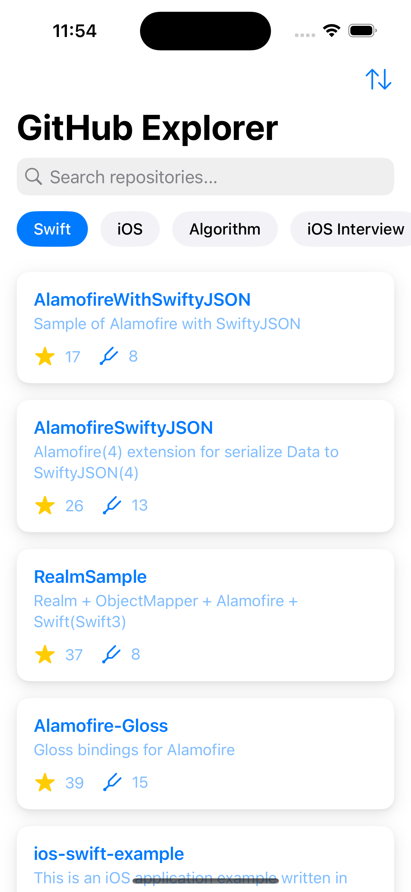
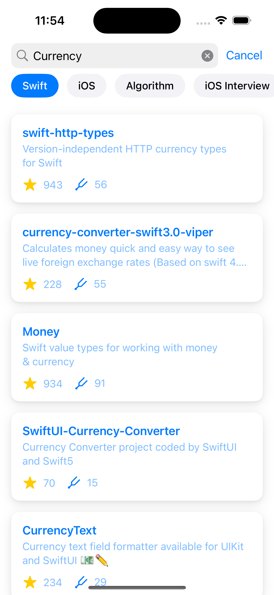

# GitHub Explorer

A modern iOS application that allows users to browse and search GitHub repositories with a focus on Swift and iOS development resources.

## Features

- **Browse Repositories**: View trending repositories in different categories:
  - Swift
  - iOS
  - Algorithm
  - iOS Interview
- **Search**: Find repositories by keyword with real-time results
- **Sort Options**: Organize repositories by stars or forks (ascending/descending)
- **Detailed Views**: Explore repository and owner details with a clean, intuitive interface
- **Modern UI**: Built with SwiftUI featuring smooth animations and loading states

# 📱 App Demo

Here's a quick look at the app in action:

<p align="center">
  
</p>


## 🖼️ Screenshots

<p align="center">
  
  
  
  
  
  
  

</p>

## 📖 Read the Article

Curious about the latest in Swift Testing? Dive deep into modern testing strategies with Xcode 16.

> 🧪 **Swift Testing — A Modern Testing Framework in Xcode 16**

[👉 Read the full article here](https://swiftpublished.com/article/swift-testing)

> ✍️ *Explore Swift Testing, new features, best practices, and how to integrate it into your iOS projects effectively.*

## Requirements

- iOS 16.0+
- Xcode 16.0+
- Swift 5.9+

## Installation

1. Clone the repository
   ```bash
   git clone https://github.com/yourusername/GithubExplorerTest.git
   ```

2. Open the project in Xcode
   ```bash
   cd GithubExplorerTest
   open GithubExplorerTest.xcodeproj
   ```

3. Build and run the application on your device or simulator

## Architecture

This project follows the MVVM (Model-View-ViewModel) architectural pattern:

- **Models**: Data structures like Repository and Owner
- **Views**: SwiftUI views (GithubHomeView, RepositoryDetailView, OwnerDetailView)
- **ViewModels**: Business logic components (GithubHomeViewModel, RepositoryDetailViewModel, OwnerDetailViewModel)

## Testing

The project includes both XCTest and Swift Testing Framework examples to demonstrate different testing approaches:

- Unit tests for ViewModels
- API service mocking
- UI testing examples

Run tests using Xcode's Test Navigator or via command line:
```bash
xcodebuild test -project GithubExplorerTest.xcodeproj -scheme GithubExplorerTest -destination 'platform=iOS Simulator,name=iPhone 16'
```

## API

The application uses the GitHub REST API to fetch repository data:
- Search repositories
- Get repository details
- Fetch owner information

## License

[MIT License](LICENSE)

## Acknowledgements

- [GitHub API](https://docs.github.com/en/rest)
- [SwiftUI](https://developer.apple.com/xcode/swiftui/)
- [Swift Concurrency](https://docs.swift.org/swift-book/LanguageGuide/Concurrency.html)
